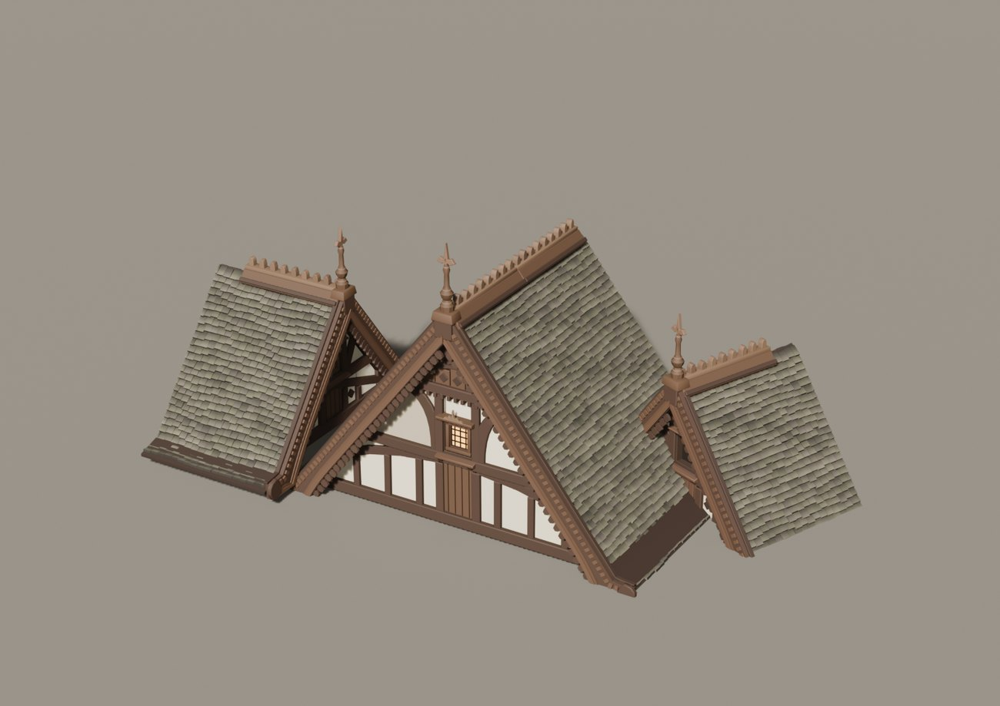
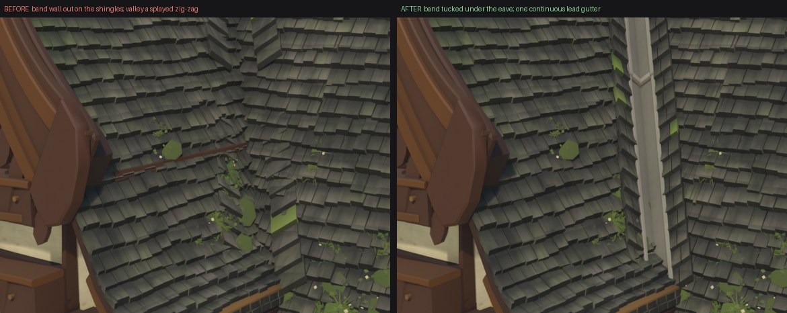

# Architecture Kit

A Claude Code skill that builds **modular 3D building kits** in Blender — pieces that snap
to a grid and combine into many different buildings — then checks them with a validator
suite and a harsh critic until they hold up.

Any style: half-timber, machiya, adobe, Hausmannian, whatever you name.


---

## Install

```bash
git clone https://github.com/Lunarsong/architecture-kit.git ~/.claude/skills/architecture-kit
```

Or per-project:

```bash
git clone https://github.com/Lunarsong/architecture-kit.git .claude/skills/architecture-kit
```

## Use

```
/architecture-kit
```

It asks you what you're building, what style, and for reference images — then builds.

---

## What you get

**A kit, not a model.** Every piece is a function on a shared grid, so the same parts make
different buildings:


**Pieces that actually fit.** Wall origins at bay centres, corners filling the voids
between runs, one roof pitch kit-wide:



**Real construction.** Arcades, galleries, jetties, proper joints — measured against your
references:


**Detail that survives close-up.** Openings sized by contract, one sill per window, inserts
that ride their host's scale:


---

## The loop

Three roles, fresh context each, and none of them grade their own homework:

| | |
|---|---|
| **builder** | owns one file, fixes named defects, measures before and after |
| **auditor** | owns nothing, re-measures the builder's numbers, hunts for more |
| **critic** | sees two images side by side, labels stripped, picks one |

Findings come back as numbers, so a fix is provable:



```
worst clearance   0.684 m  ->  0.485 m
verts > 0.25 m       968   ->     655
```

---

## What it checks

- **seams** — pieces tile with no gap or overlap
- **z-fighting** — coincident surfaces, at the tolerance an engine cares about
- **reachability** — is a defect actually visible, or sealed inside the mesh
- **interpenetration** — solids pushed through each other
- **through-surface** — walls emerging through roofs
- **run continuity** — holes in a wall run
- **members land** — does the post actually reach the beam
- **insert scale** — does a window scale with the wall it sits in
- **determinism** — same code, same mesh, every run
- **real-world sense** — human scale, real joinery, water runs off the roof

Two of these ship working, ready to drop in:

```bash
blender -b --python assets/check_structure.py -- out/your_scene.blend
ZFIGHT_TOL=0.0005 blender -b --python assets/check_zfight.py -- walls
```

---

## Output

- one showpiece building, plus at least two more from the same kit
- `.blend` and `.glb`, round-tripped and reported
- a local progress page with every family render and every finding
- per-family renders: demo, closeup, lineup, tiled

---

## Files

```
SKILL.md                      the playbook
references/VALIDATORS.md      10 validators, and the 4 ways a z-fight checker lies to you
references/FAULT-CLASSES.md   the defects that recur, so you catch them first
references/LOOP.md            builder/auditor/critic shape and schemas
assets/check_structure.py     through-surface + run continuity, works as-is
assets/check_zfight.py        coincident surfaces, four known faults already fixed
```

---

Images are from the medieval inn kit this skill was distilled from — 153 pieces, 14
families, four buildings.

MIT licensed.
