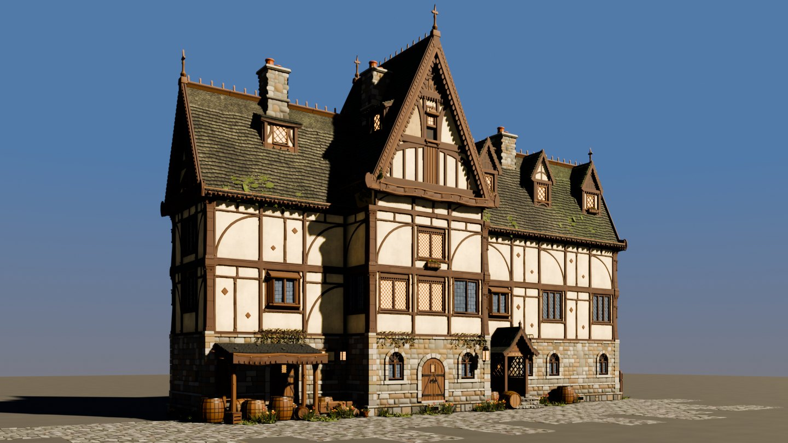
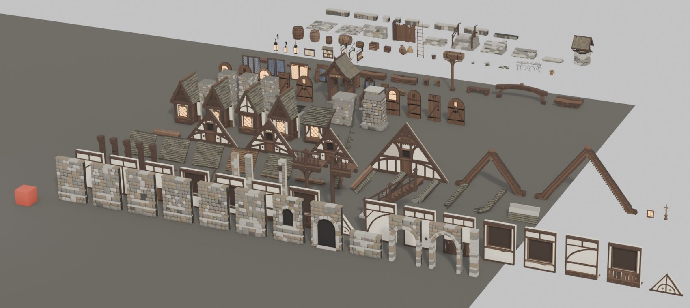
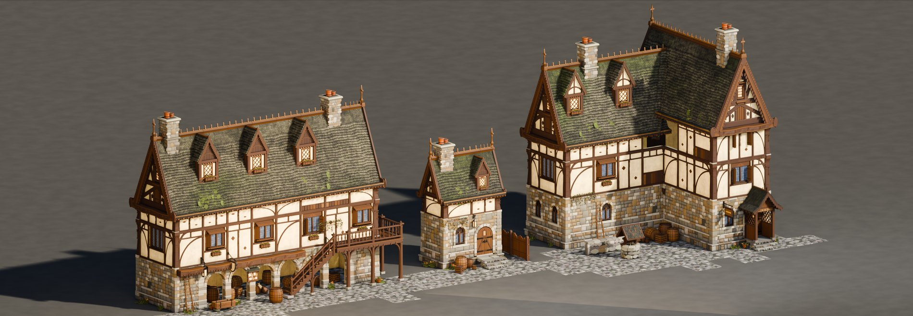
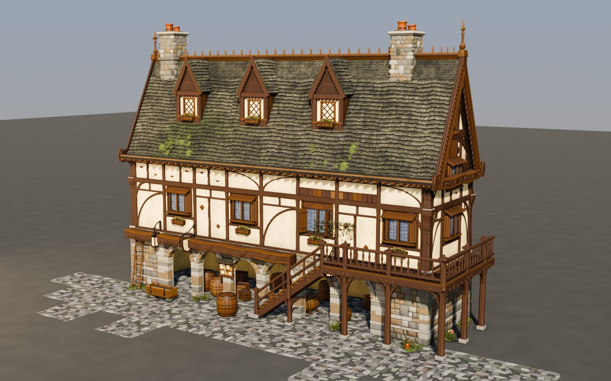
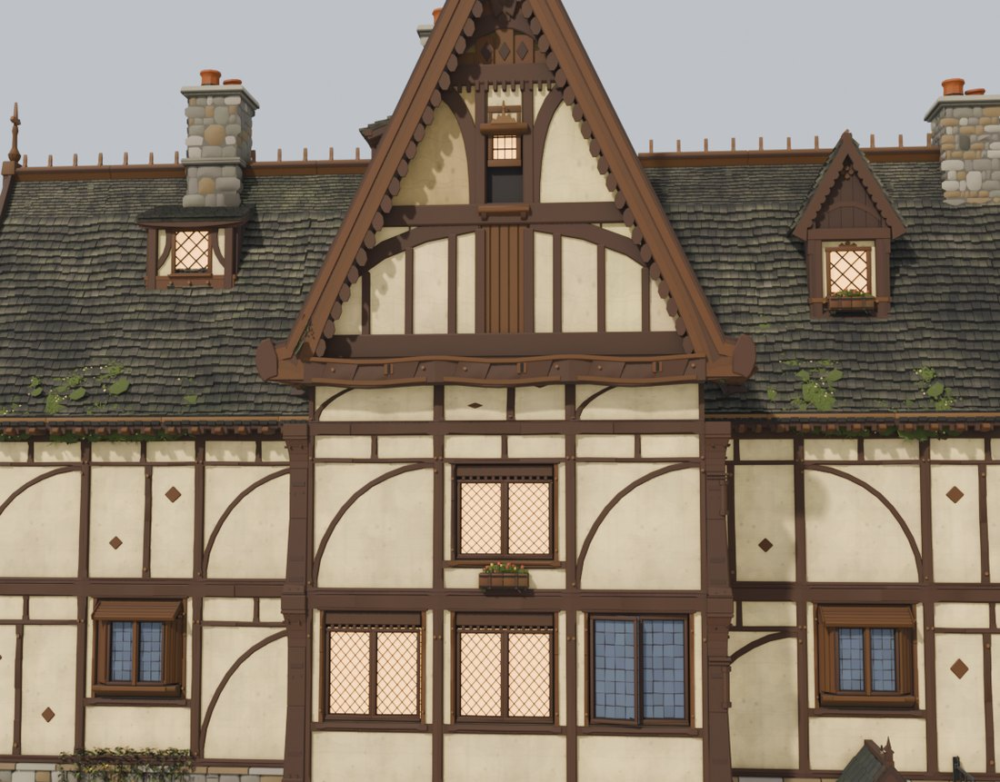

# Architecture Kit

A Claude Code skill that builds **modular 3D building kits** in Blender — pieces that snap
to a grid and combine into many different buildings — then checks them with a validator
suite and a harsh critic until they hold up.

Any style: half-timber, Old City stone, machiya, adobe, Hausmannian, whatever you name.



---

## Install

```bash
git clone https://github.com/Lunarsong/architecture-kit.git ~/.claude/skills/architecture-kit
```

Or per-project:

```bash
git clone https://github.com/Lunarsong/architecture-kit.git .claude/skills/architecture-kit
```

## Use

```
/architecture-kit
```

Say what you're building and attach references. It asks follow-ups, and asks for images if
you didn't attach any.

A good prompt names **the material, the roof, and at least two building types** — the
second building is what forces the parts to be genuinely modular.

### Example — medieval half-timber

> `/architecture-kit`
>
> A medieval fantasy inn kit, slightly stylised. Stone ground floor, half-timber
> above with cream plaster panels, steep shingled roof, dormers and tall chimneys.
> Needs to build the inn plus a small cottage and a market row, so the parts have
> to be modular rather than one fixed building. References attached.

### Example — Old City Jerusalem

> `/architecture-kit`
>
> An Old City Jerusalem kit. Jerusalem limestone ashlar, flat roofs with parapets
> and small domes, arched openings with deep reveals, external stone staircases,
> vaulted passages spanning the lane, iron window grilles. Needs to build a narrow
> souk street and a courtyard house. Unity, about 8k tris per piece. References
> attached.

### Example — no references yet

> `/architecture-kit`
>
> I want a Cyclades village kit but I don't have references — can you tell me what
> you need and I'll find them?

---

## What you get

**A kit, not a model.** Every piece is a function on a shared grid — walls, corners,
openings, roofs, gables, dormers, chimneys, props, ground — with half and quarter sizes
authored rather than scaled. The red cube is 1 m:



**The same parts make different buildings:**



**Real construction** — arcades, galleries, jetties, joints that exist in the real world:



**Detail that survives close-up.** Openings sized by contract, one sill per window, inserts
that ride their host's scale:



---

## The loop

Three roles, fresh context each, and none of them grade their own homework:

| | |
|---|---|
| **builder** | owns one file, fixes named defects, measures before and after |
| **auditor** | owns nothing, re-measures the builder's numbers, hunts for more |
| **critic** | sees two images side by side, labels stripped, picks one |

Findings come back as numbers, so a fix is provable rather than asserted:

```
barge worst clearance    0.684 m  ->  0.485 m
verts more than 0.25 m      968   ->     655
eave drop below wall head  1.53 m  ->  0.29 m
wall hidden behind roof       88%  ->      0%
```

---

## What it checks

- **seams** — pieces tile with no gap or overlap
- **z-fighting** — coincident surfaces, at the tolerance an engine cares about
- **reachability** — is a defect actually visible, or sealed inside the mesh
- **interpenetration** — solids pushed through each other
- **through-surface** — walls emerging through roofs
- **see-through holes** — the complement nobody tests: a *hole* in the skin, not a
  protrusion through it. One sat at a roof junction at 56% see-through while twelve other
  checks passed
- **like-on-like** — a roof piece clipping *another roof piece*, judged against the lap the
  design intends
- **run continuity** — holes in a wall run
- **members land** — does the post actually reach the beam
- **insert scale** — does a window scale with the wall it sits in
- **non-unit scale** — a stretched moulding, i.e. a piece that should have been authored
  at half or quarter size
- **the neighbourhood** — for any fix that removes geometry, measure the junction
  before *and* after; removing one defect can enlarge a second one it was masking
- **determinism** — same code, same mesh, every run
- **real-world sense** — human scale, real joinery, water runs off the roof

Three ship working, ready to drop in:

```bash
blender -b --python assets/check_structure.py -- out/your_scene.blend
blender -b --python assets/check_holes.py     -- out/your_scene.blend
ZFIGHT_TOL=0.0005 blender -b --python assets/check_zfight.py -- walls
```

---

## Output

- one showpiece building, plus at least two more from the same kit
- `.blend` and `.glb`, round-tripped and reported
- a local progress page with every family render and every finding
- per-family renders: demo, closeup, lineup, tiled
- a whole-kit sheet with a 1 m reference cube

---

## Files

```
SKILL.md                      the playbook
references/VALIDATORS.md      14 validators, and the 4 ways a z-fight checker lies to you
references/FAULT-CLASSES.md   the defects that recur, so you catch them first
references/LOOP.md            builder/auditor/critic shape and schemas
assets/check_structure.py     through-surface + like-on-like + run continuity
assets/check_holes.py         see-through holes, cast from inside out
assets/check_zfight.py        coincident surfaces, four known faults already fixed
```

---

## The kit this was distilled from

Every image above comes from one build: a medieval half-timber kit of **182 pieces across
14 families**, making an inn, a market row, a cottage and an L-plan cross-wing. The whole
thing — pieces, generator scripts, validators, and prebuilt `.blend` and `.glb` — is
public, so you can see what this skill's output actually looks like before running it:

**→ [Lunarsong/medieval-architecture-kit](https://github.com/Lunarsong/medieval-architecture-kit)**

Its README also lists what is still open, with the measurement for each — which is the
habit this skill is really trying to teach.

MIT licensed.
